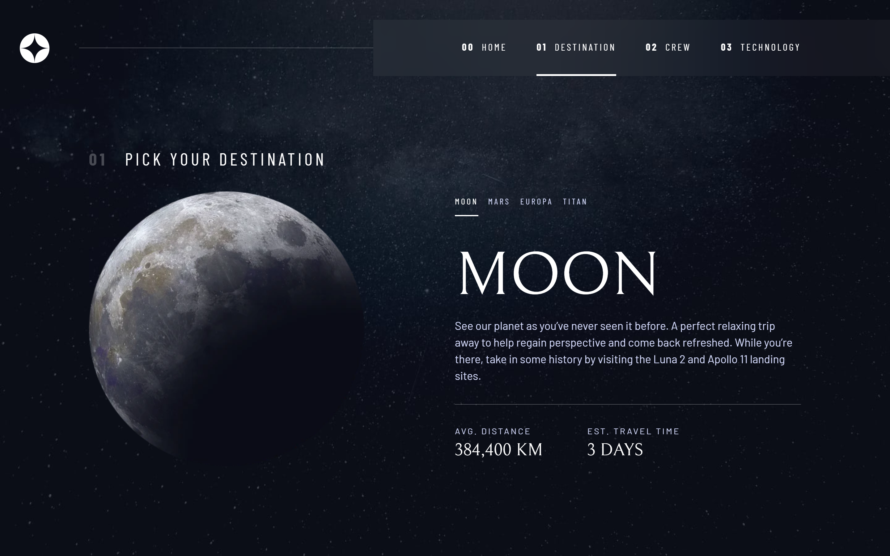

# Frontend Mentor - Space tourism website solution

This is a solution to the [Space tourism website challenge on Frontend Mentor](https://www.frontendmentor.io/challenges/space-tourism-multipage-website-gRWj1URZ3). Frontend Mentor challenges help you improve your coding skills by building realistic projects.

## The challenge

Users should be able to:

- View the optimal layout for each of the website's pages depending on their device's screen size
- See hover states for all interactive elements on the page
- View each page and be able to toggle between the tabs to see new information

## Screenshots

## Links

- Solution URL: https://www.frontendmentor.io/solutions/space-tourism-multipage-website-Eeoj6x11tZ
- Live Site URL: https://space-tourism-solch4.netlify.app/

## Built with

- Semantic HTML5 markup
- Flexbox
- CSS Grid
- Mobile-first workflow
- [React](https://reactjs.org/) - JS library
- [Sass / SCSS](https://sass-lang.com/) - CSS pre-processor

## Author

- GitHub - [@solch4](https://github.com/solch4/)
- LinkedIn - [Sol Maldonado](https://www.linkedin.com/in/sol-maldonado-fullstack/)
- Frontend Mentor - [@solch4](https://www.frontendmentor.io/profile/solch4)